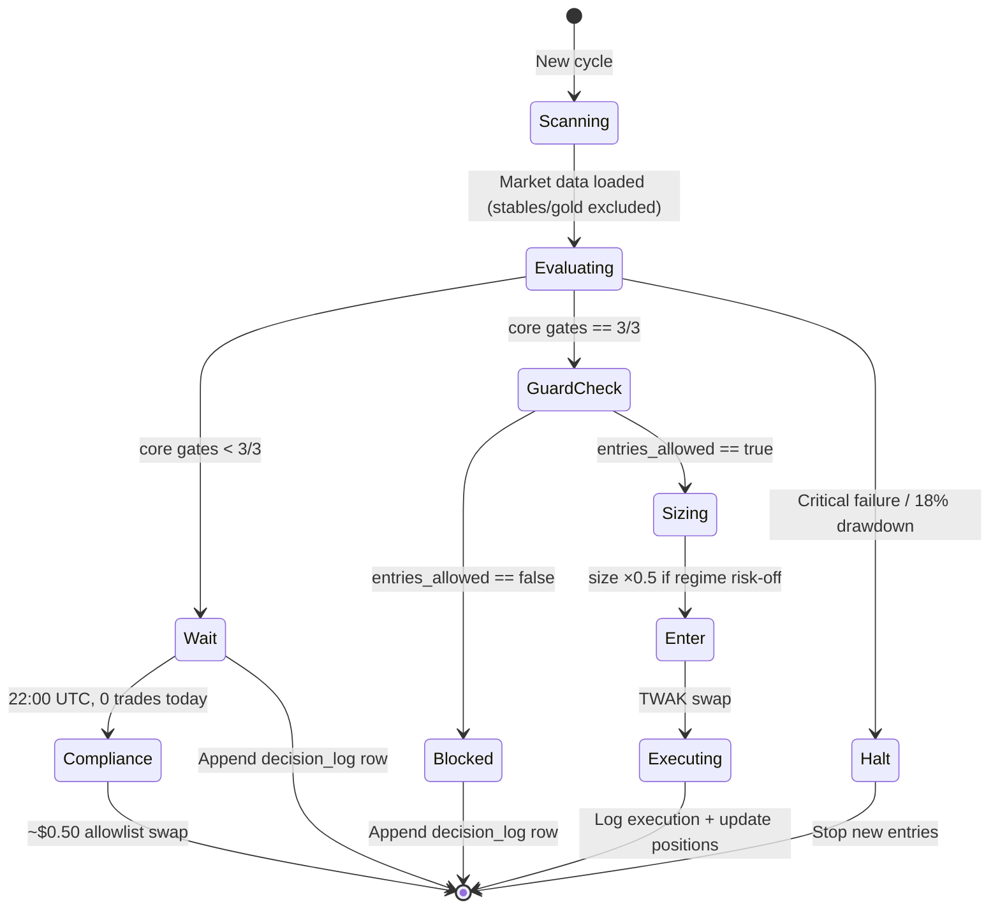
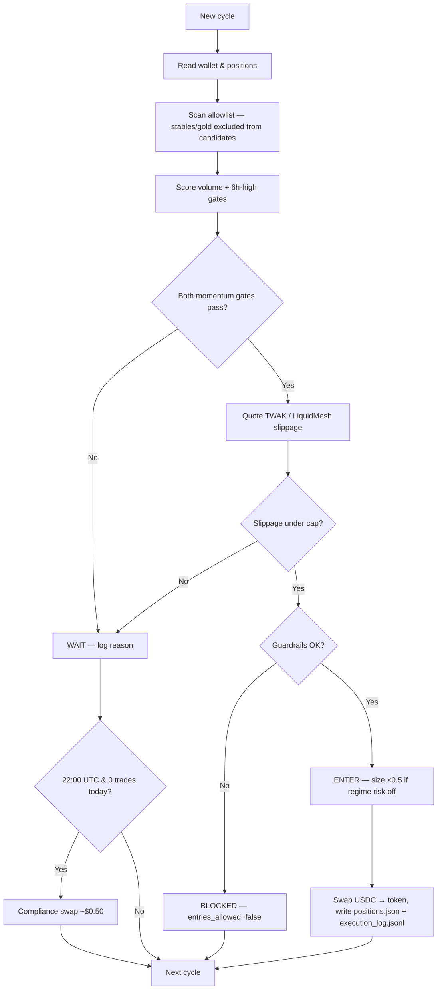
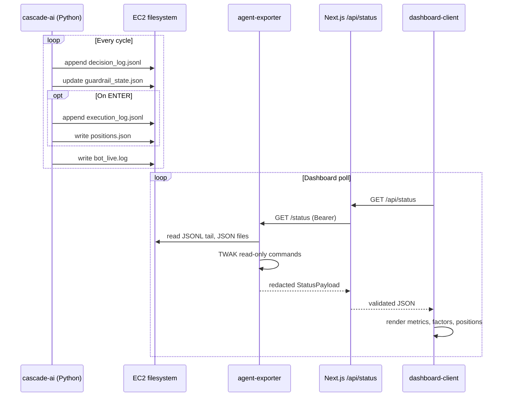

# Cascade AI Trading Algorithm

Technical reference for the BSC autonomous trading agent's **buy decision system**, as observed, validated, and rendered by **cascade-ai-dashboard**.

> **Repository scope.** The Python bot that *runs* the algorithm lives in a separate repository (`cascade-ai`, deployed on EC2 at `CASCADE_AI_PATH`). This repo is a **read-only operator console**: it consumes agent telemetry, normalizes it, and visualizes it. The scoring logic documented here reflects the data contract (`decision_log.jsonl`) and dashboard interpretation—not the bot's internal Python implementation.

---

## Table of contents

1. [Executive summary](#1-executive-summary)
2. [Design philosophy](#2-design-philosophy)
3. [Architecture and data flow](#3-architecture-and-data-flow)
4. [Trading cycle](#4-trading-cycle)
5. [Decision state machine](#5-decision-state-machine)
6. [The six entry factors](#6-the-six-entry-factors)
7. [Decision actions](#7-decision-actions)
8. [Safety guardrails](#8-safety-guardrails)
9. [Execution pipeline](#9-execution-pipeline)
10. [Position management and exits](#10-position-management-and-exits)
11. [Token allowlist](#11-token-allowlist)
12. [Market data pipeline (CMC / x402)](#12-market-data-pipeline-cmc--x402)
13. [Data contract (schemas)](#13-data-contract-schemas)
14. [Agent files on EC2](#14-agent-files-on-ec2)
15. [Exporter API reference](#15-exporter-api-reference)
16. [Dashboard code map](#16-dashboard-code-map)
17. [UI rendering and metrics](#17-ui-rendering-and-metrics)
18. [Full telemetry payload walkthrough](#18-full-telemetry-payload-walkthrough)
19. [Edge cases and boundary behavior](#19-edge-cases-and-boundary-behavior)
20. [Tests](#20-tests)
21. [Local debugging](#21-local-debugging)
22. [Security model](#22-security-model)
23. [Diagrams](#23-diagrams)
24. [Glossary](#24-glossary)
25. [Quick reference](#25-quick-reference)

---

## 1. Executive summary

Cascade AI is an autonomous trading agent for BNB Chain. Each cycle it:

1. Reads wallet state and open positions from disk.
2. Fetches market data for every token on a **~149-token BEP-20 competition allowlist**.
3. Scores each candidate against **six binary factors** (pass/fail gates).
4. Applies **safety guardrails** (daily loss budget, trade caps, macro regime).
5. Emits one of four actions: `ENTER`, `WAIT`, `BLOCKED`, or `HALT`.
6. On `ENTER`, sizes a USDC position and swaps into the target token via **TWAK / LiquidMesh**.

**Core rule (algorithm v2, deployed 2026-06-12):** the six factors split into roles. Three **core gates** must all pass to be *eligible* for `ENTER`: `volume_breakout`, `six_hour_high_break`, and `slippage_under_cap`. `regime_not_risk_off` no longer vetoes — when false it **halves position size**. `rsi_in_range` and `derivatives_risk_clear` are **informational** (logged, fail closed on missing data, do not gate entry). A partial core score yields `WAIT`. Guardrails can still veto a perfect score.

**Candidate filter (v2):** stablecoins and gold-backed tokens (USDT, USDC, USDe, XAUt, XAUM, etc. — 18 symbols) are excluded from momentum candidate selection. They remain valid to hold.

**Competition floor (v2):** if no trade has executed by 22:00 UTC, the bot performs a ~$0.50 allowlist swap (never BNB) to satisfy the BNB Hack one-trade-per-day minimum. The internal drawdown kill switch is set to 18% (competition DQ is ~30%).

**Quote asset:** entries are funded from **USDC**. The bot does not enter with BNB or other base assets unless configured otherwise in the bot repo.

> **v1 history.** Before 2026-06-12 the bot required 3 of 4 "core" factors including regime as a hard veto, RSI/derivatives silently passed on missing data, and stablecoins could win candidate ranking. An 8-hour live run (102 cycles, 0 entries) exposed all three issues; see git history of this file for the v1 description.

---

## 2. Design philosophy

The strategy is intentionally **checklist-driven, not discretionary**:

| Principle | How it shows up in telemetry |
|-----------|------------------------------|
| **No partial buys** | 2/3 core gates → `WAIT`, never a partial entry (regime only scales size) |
| **Objective gates** | Each factor is boolean in `factor_scores` |
| **Safety first** | `entries_allowed: false` + `BLOCKED` even when signals look good |
| **Auditability** | Every cycle appends one JSONL row to `decision_log.jsonl` |
| **Separation of concerns** | Dashboard reads logs; it never triggers trades |

The in-dashboard explainer lives in `apps/web/src/components/decision-algorithm-panel.tsx` under the **Strategy explainer** tab.

---

## 3. Architecture and data flow

```
┌─────────────────┐     writes       ┌──────────────────────────────┐
│  cascade-ai     │ ───────────────► │  EC2 filesystem              │
│  (Python bot)   │                  │  decision_log.jsonl          │
│  python -m      │                  │  execution_log.jsonl         │
│  src.main       │                  │  positions.json              │
└─────────────────┘                  │  guardrail_state.json        │
                                     │  bot_live.log / agent.log    │
                                     │  price_cache.json            │
                                     │  volume_cache.json           │
                                     └──────────────┬───────────────┘
                                                    │ read-only
                                                    ▼
                                     ┌──────────────────────────────┐
                                     │  agent-exporter (:8787)      │
                                     │  Express + Bearer auth       │
                                     │  GET /status, /decisions…    │
                                     └──────────────┬───────────────┘
                                                    │ server-side fetch
                                                    ▼
                                     ┌──────────────────────────────┐
                                     │  apps/web (Next.js)          │
                                     │  GET /api/status             │
                                     │  dashboard-client.tsx        │
                                     │  decision-algorithm-panel    │
                                     └──────────────────────────────┘
```

### Key constraints

- The dashboard **never** talks to the bot process directly.
- The dashboard **never** calls `twak swap` or any mutation endpoint.
- The exporter token stays **server-side** in `apps/web/src/app/api/status/route.ts`—never exposed as `NEXT_PUBLIC_*`.
- Browser polls `/api/status`; that route proxies to the EC2 exporter with `Authorization: Bearer $AGENT_EXPORTER_TOKEN`.

Configuration (see [`README.md`](../README.md)):

| Variable | Role |
|----------|------|
| `CASCADE_AI_PATH` | Path to bot data directory on EC2 (e.g. `/home/ec2-user/cascade-ai`) |
| `AGENT_EXPORTER_URL` | HTTPS URL of the telemetry exporter |
| `AGENT_EXPORTER_TOKEN` | Shared secret for dashboard ↔ exporter |
| `USE_MOCK_AGENT_DATA` | When `true`, serves built-in demo telemetry |

---

## 4. Trading cycle

Defined in `decision-algorithm-panel.tsx` as `CYCLE_STEPS`:

| Step | Title | Description |
|------|-------|-------------|
| **01** | Wake up | Agent reads wallet balances and loads open positions from disk. |
| **02** | Scan targets | Pulls fresh market data (CoinMarketCap / x402) for every allowlist token—often ~149 symbols per cycle. |
| **03** | Score factors | Stables/gold excluded, then 3 core gates (volume, 6h-high, slippage). One core miss → wait. |
| **04** | Apply guardrails | Daily loss limits, trade caps, or 18% drawdown kill switch can veto entry. Risk-off regime halves size. |
| **05** | Decide & act | Only when all 3 core gates pass and guardrails allow → USDC → token swap via TWAK (size ×0.5 if regime risk-off). |

### Per-cycle telemetry fields

| Field | Meaning |
|-------|---------|
| `cycle_number` | Monotonic cycle identifier |
| `timestamp` | ISO-8601 time of decision |
| `mode` | `"paper"` or `"live"` |
| `priced_target_count` | How many allowlist tokens received a price quote this cycle |
| `portfolio_value_usdc` | Strategy portfolio valuation at decision time |
| `position_count` | Number of open positions |
| `symbol` | Best candidate token this cycle (even on WAIT) |
| `reason` | Human-readable explanation |

Typical log tail line (from `health.lastLogLine`):

```
cycle complete action=WAIT symbol=AAVE
```

---

## 5. Decision state machine

Formal view of how actions relate to factor scores and guardrails:



### Action precedence (dashboard interpretation)

When reading a decision row, interpret fields in this order:

1. **`action`** — primary outcome label.
2. **`entries_allowed`** — whether guardrails permit new entries this cycle.
3. **`factor_scores` / `true_factor_count`** — technical checklist result.
4. **`reason`** — bot-authored narrative; may encode extra nuance (dynamic thresholds, confirmation waits).

---

## 6. The six entry factors

Canonical keys in `apps/web/src/lib/factor-scoring.ts`:

```typescript
export const ENTRY_FACTOR_KEYS = [
  "volume_breakout",
  "six_hour_high_break",
  "regime_not_risk_off",
  "slippage_under_cap",
  "rsi_in_range",
  "derivatives_risk_clear",
] as const;

export const ENTRY_FACTOR_COUNT = ENTRY_FACTOR_KEYS.length; // 6
```

### 6.1 Factor reference table

| # | Key | Role (v2) | Plain-language meaning | Data source |
|---|-----|-----------|------------------------|-------------|
| 1 | `volume_breakout` | **Core gate** | Recent volume is significantly above its recent average—real interest, not a low-liquidity wiggle | CoinMarketCap price & volume history |
| 2 | `six_hour_high_break` | **Core gate** | Price trades above the rolling local high (price cache preferred, then 3h/6h snapshot highs)—short-term upward momentum | Rolling price cache + OHLC snapshot |
| 3 | `regime_not_risk_off` | **Size modifier** | Broader market (BTC trend, sentiment) defensive → position size ×0.5. Does not veto. | BTC trend & market regime signal |
| 4 | `slippage_under_cap` | **Core gate** | Estimated swap price impact is below the configured slippage cap. Quoted only after both momentum gates pass. | TWAK / LiquidMesh route quote |
| 5 | `rsi_in_range` | Informational | 14-period RSI is strong enough to buy but not overheated. Fails closed on missing data. | RSI on recent candles |
| 6 | `derivatives_risk_clear` | Informational | Funding rates and leveraged positioning do not flash systemic danger. Fails closed on missing data. | Funding rates & derivatives metrics |

Each factor is **binary** in telemetry: `true` = pass; `false` or absent = fail. Entry requires the three core gates; the other three never gate entry on their own.

### 6.2 Factor metadata in UI

`decision-algorithm-panel.tsx` defines `ENTRY_FACTORS` with `title`, `plain`, `detail`, and `dataSource` for each factor—used in the Strategy explainer cards.

### 6.3 Scoring logic (dashboard)

```typescript
// apps/web/src/lib/factor-scoring.ts

export function countPassedFactors(
  scores: StatusPayload["decisions"][number]["factor_scores"],
  keys: readonly string[] = ENTRY_FACTOR_KEYS,
) {
  return keys.filter((key) => Boolean(scores?.[key])).length;
}

export const CORE_ENTRY_FACTOR_KEYS = [
  "volume_breakout",
  "six_hour_high_break",
  "slippage_under_cap",
] as const;

export function entryFactorStats(decision: StatusPayload["decisions"][number]) {
  const passed =
    typeof decision.true_factor_count === "number"
      ? decision.true_factor_count
      : countPassedFactors(decision.factor_scores);
  const corePassed = countPassedFactors(decision.factor_scores, CORE_ENTRY_FACTOR_KEYS);

  return {
    passed,                                  // X/6 display count
    total: ENTRY_FACTOR_COUNT,
    corePassed,                              // X/3 entry-gating count
    coreTotal: CORE_ENTRY_FACTOR_COUNT,
    required: CORE_ENTRY_FACTOR_COUNT,
    met: corePassed >= CORE_ENTRY_FACTOR_COUNT,
  };
}

export function decisionFactorSummary(decision: StatusPayload["decisions"][number]) {
  const stats = entryFactorStats(decision);
  return `${stats.passed}/${stats.total} factors`;
}
```

**Priority rule:** if the bot sends `true_factor_count`, the dashboard treats it as authoritative for the numeric score. Otherwise it recomputes from `factor_scores`.

### 6.4 Dynamic threshold parsing from `reason`

Some bot versions may encode a non-default required count in the reason string:

```typescript
export function parseRequiredFactorCount(reason: string | null | undefined): number | null {
  if (!reason) return null;
  const match = reason.match(/need (\d+)\)/);
  return match ? Number.parseInt(match[1] ?? "", 10) : null;
}
```

Used in `log-event-details.ts`:

```typescript
const required = parseRequiredFactorCount(decision.reason) ?? factors.required;
// Display: "5/6 total · 2/3 core (need 3 core to enter)"; "need N" parsed from reason when present
```

---

## 7. Decision actions

Shared Zod enum in `apps/web/src/lib/schemas.ts` and `agent-exporter/src/schemas.ts`:

```typescript
action: z.enum(["ENTER", "WAIT", "BLOCKED", "HALT"])
```

| Action | UI color | Meaning |
|--------|----------|---------|
| **ENTER** | Green | Buy approved. Factors met + `entries_allowed: true`. Computes `position_size_usdc` and executes swap. |
| **WAIT** | Yellow | One or more factors failed, or bot wants stronger confirmation. No capital moves. Logs `reason`. |
| **BLOCKED** | Orange | Technical signals may look good, but a **guardrail** vetoed entry (`entries_allowed: false`). |
| **HALT** | Red | Critical failure or manual halt. Agent stops opening new positions until cleared. |

### 7.1 Tone mapping

```typescript
// apps/web/src/lib/agent-log.ts
export function decisionActionTone(action: Decision["action"]): "green" | "yellow" | "red" {
  if (action === "HALT") return "red";
  if (action === "ENTER") return "green";
  return "yellow"; // WAIT, BLOCKED
}
```

### 7.2 Example: WAIT (5/6)

From `agent-exporter/fixtures/decision_log.jsonl`, cycle 121:

```json
{
  "timestamp": "2026-06-05T16:00:00Z",
  "cycle_number": 121,
  "mode": "paper",
  "portfolio_value_usdc": 1142.33,
  "position_count": 1,
  "entries_allowed": true,
  "action": "WAIT",
  "symbol": "BNB",
  "position_size_usdc": 0,
  "factor_scores": {
    "volume_breakout": true,
    "six_hour_high_break": false,
    "regime_not_risk_off": true,
    "slippage_under_cap": true,
    "rsi_in_range": true,
    "derivatives_risk_clear": true
  },
  "true_factor_count": 5,
  "estimated_slippage_pct": 0.11,
  "reason": "Waiting for six hour high confirmation.",
  "priced_target_count": 8
}
```

`six_hour_high_break: false` → 5/6 → `WAIT`.

### 7.3 Example: ENTER (3/3 core)

From `apps/web/src/lib/mock-data.ts`, cycle 122:

```json
{
  "cycle_number": 122,
  "action": "ENTER",
  "symbol": "CAKE",
  "entries_allowed": true,
  "position_size_usdc": 75,
  "factor_scores": {
    "volume_breakout": true,
    "six_hour_high_break": true,
    "regime_not_risk_off": true,
    "slippage_under_cap": true,
    "rsi_in_range": true,
    "derivatives_risk_clear": true
  },
  "true_factor_count": 6,
  "estimated_slippage_pct": 0.18,
  "reason": "3/3 core factors passed (6/6 total)"
}
```

### 7.4 Example: BLOCKED (guardrail)

Cycle 123:

```json
{
  "cycle_number": 123,
  "action": "BLOCKED",
  "symbol": "TWT",
  "entries_allowed": false,
  "factor_scores": {
    "volume_breakout": true,
    "six_hour_high_break": true,
    "regime_not_risk_off": false,
    "slippage_under_cap": true,
    "rsi_in_range": true,
    "derivatives_risk_clear": false
  },
  "true_factor_count": 4,
  "reason": "Entry blocked by risk-off regime guardrail."
}
```

Note: `regime_not_risk_off: false` both fails a factor **and** triggers the risk-off guardrail narrative.

### 7.5 Simulated examples in UI

`decision-algorithm-panel.tsx` ships two static snapshots:

- **`SIMULATED_PASSING_SIGNAL`** — CAKE, 3/3 core, `ENTER`
- **`SIMULATED_NON_PASSING_SIGNAL`** — LINK, 2/3 core (`six_hour_high_break: false`), `WAIT`

Plus a live snapshot bound to `latestDecision` from telemetry.

---

## 8. Safety guardrails

Persisted in `guardrail_state.json`, schema:

```typescript
export const guardrailsSchema = z.object({
  daily_realized_loss: nullableNumber,
  daily_trade_count: nullableNumber,
  last_reset_date: z.string().nullable().optional(),
  portfolio_ath: nullableNumber,
}).passthrough();
```

### 8.1 Example state

```json
{
  "daily_realized_loss": -3.25,
  "daily_trade_count": 2,
  "last_reset_date": "2026-06-05",
  "portfolio_ath": 1194.42
}
```

### 8.2 Guardrail catalog (UI-documented)

| Guardrail | Telemetry field | Effect |
|-----------|-----------------|--------|
| **Risk-off regime (v2: sizing only)** | `regime_not_risk_off` factor | Halves position size when macro turns defensive; no longer pauses buys |
| **Daily loss budget** | `daily_realized_loss` | Caps realized losses for the calendar day |
| **Daily trade cap** | `daily_trade_count` | Limits entry count per day |
| **Portfolio ATH tracking** | `portfolio_ath` | Drawdown-aware reference; kill switch halts entries at **18% drawdown** from ATH (`DRAWDOWN_KILL_SWITCH_PCT=0.18`) |
| **Daily minimum trade (v2)** | `daily_trade_count` + compliance marker | At 22:00 UTC with zero trades, executes a ~$0.50 allowlist swap (never BNB) to satisfy the competition's 1-trade/day rule |
| **Portfolio floor (v2)** | spend capping | Never spends the portfolio below ~$2 — competition scores any hour starting ≤$1 as 0% |

When guardrails block entries, the bot sets `entries_allowed: false` and typically emits `BLOCKED`.

### 8.3 Relationship to `entries_allowed`

| `entries_allowed` | Typical `action` | Meaning |
|-------------------|------------------|---------|
| `true` | `ENTER` or `WAIT` | Guardrails permit entries; WAIT means factors failed |
| `false` | `BLOCKED` | Guardrails veto; factors may still look partially good |
| `null` / missing | any | Dashboard shows "N/A"; rely on explicit `action` |

---

## 9. Execution pipeline

When `action === "ENTER"`, the bot (outside this repo) performs:

### 9.1 Steps

1. **Size** — compute `position_size_usdc` from portfolio value and risk rules.
2. **Quote** — TWAK requests a LiquidMesh route; populate `estimated_slippage_pct`.
3. **Swap** — USDC → target token on BSC with `max_slippage_pct` cap.
4. **Log** — append row to `execution_log.jsonl`.
5. **Track** — update `positions.json` with entry price, trailing stop, take-profit.

### 9.2 Execution schema

```typescript
export const executionSchema = z.object({
  timestamp: z.string(),
  action: z.string().nullable().optional(),       // typically "SWAP"
  from_symbol: z.string().nullable().optional(),  // "USDC"
  to_symbol: z.string().nullable().optional(),
  amount_in: nullableNumber,
  max_slippage_pct: nullableNumber,
  expected_amount_out: nullableNumber,
  result: z.record(z.string(), z.unknown()).nullable().optional(),
  tx_hash: z.string().nullable().optional(),
  approval_hash: z.string().nullable().optional(),
  provider: z.string().nullable().optional(),
  error: z.string().nullable().optional(),
}).passthrough();
```

### 9.3 Paper vs live execution

| Mode | `result.mode` | `tx_hash` | On-chain |
|------|---------------|-----------|----------|
| **paper** | `"paper"` | e.g. `"paper-122"` | No real transaction |
| **live** | `"twak"` | `0x…` hex | BscScan-explorable |

Paper fixture:

```json
{
  "timestamp": "2026-06-05T16:05:12Z",
  "action": "SWAP",
  "from_symbol": "USDC",
  "to_symbol": "CAKE",
  "amount_in": 75,
  "max_slippage_pct": 0.5,
  "expected_amount_out": 18.43,
  "result": { "mode": "paper", "provider": "twak" },
  "tx_hash": "paper-122"
}
```

Live fixture (from `apps/web/fixtures/mock-status.json`):

```json
{
  "action": "SWAP",
  "from_symbol": "USDC",
  "to_symbol": "BNB",
  "amount_in": 0.5,
  "max_slippage_pct": 0.5,
  "result": {
    "mode": "twak",
    "provider": "LiquidMesh",
    "input": "0.5 USDC",
    "output": "0.000828458273533057 BNB",
    "explorer": "https://bscscan.com/tx/0x2b5db498c97d6c69af6718872feb749457e7e6434c17569a34a2f78ff64eda94"
  },
  "tx_hash": "0x2b5db498c97d6c69af6718872feb749457e7e6434c17569a34a2f78ff64eda94",
  "approval_hash": "0x5863c33ba5fbfd7016fae9dfe062d853213b198376862fd76ce81336a20fe7d0"
}
```

### 9.4 Success detection (dashboard)

```typescript
function executionSucceeded(execution: StatusPayload["executions"][number]) {
  const status = String(execution.result?.status ?? execution.result?.mode ?? "").toLowerCase();
  return Boolean(
    execution.tx_hash ||
    execution.result?.tx_hash ||
    execution.result?.hash ||
    status.includes("success")
  );
}

function executionFailed(execution: StatusPayload["executions"][number]) {
  return Boolean(execution.error || String(execution.result?.error ?? "").trim());
}
```

**Execution rate metric:** `successes / (successes + failures)` over resolved executions only—pending rows excluded.

---

## 10. Position management and exits

Entry is not the end of the lifecycle. Open positions are tracked in `positions.json`.

### 10.1 Position schema

```typescript
export const positionSchema = z.object({
  symbol: z.string(),
  amount_tokens: nullableNumber,
  entry_price: nullableNumber,
  entry_value_usdc: nullableNumber,
  highest_price: nullableNumber,        // peak since entry (for trailing stop)
  trailing_stop_price: nullableNumber,  // dynamic stop level
  take_profit_price: nullableNumber,    // fixed TP target
  opened_at: z.string().nullable().optional(),
}).passthrough();
```

### 10.2 Example open positions

```json
{
  "positions": [
    {
      "symbol": "BNB",
      "amount_tokens": 0.192,
      "entry_price": 625.5,
      "entry_value_usdc": 120,
      "highest_price": 639.2,
      "trailing_stop_price": 606.1,
      "take_profit_price": 682.4,
      "opened_at": "2026-06-05T15:10:44Z"
    },
    {
      "symbol": "CAKE",
      "amount_tokens": 18.43,
      "entry_price": 4.07,
      "entry_value_usdc": 75,
      "highest_price": 4.18,
      "trailing_stop_price": 3.9,
      "take_profit_price": 4.62,
      "opened_at": "2026-06-05T16:05:12Z"
    }
  ]
}
```

### 10.3 Exit logic (inferred from persisted fields)

The bot repo implements exit triggers; from telemetry we observe:

| Mechanism | Field | Behavior |
|-----------|-------|----------|
| **Trailing stop** | `trailing_stop_price` | Updated as `highest_price` rises; exit when price falls below stop |
| **Take profit** | `take_profit_price` | Fixed upside target from entry |
| **Highest mark** | `highest_price` | Running peak used to ratchet the trailing stop |

The dashboard **Active Positions** tab renders these fields from `positions.json` on EC2—it does not compute stops client-side.

### 10.4 Close decision actions

```typescript
// apps/web/src/lib/competition-tokens.ts
const CLOSE_DECISION_ACTIONS = new Set(["EXIT", "CLOSE", "SELL"]);
```

`openPositionsFromDecisions()` builds a map: `ENTER` opens by symbol; close actions remove. Used when reconciling decision history with holdings.

---

## 11. Token allowlist

~149 BEP-20 tokens eligible for BNB Hack Track 1:

```typescript
// apps/web/src/lib/competition-tokens.ts
// BNB Hack Track 1 eligible BEP-20 tokens (149-token allowlist).
// Source: https://dorahacks.io/hackathon/bnbhack-twt-cmc/detail
export const COMPETITION_TOKENS = [ "ETH", "USDT", "USDC", "XRP", ... ];
```

### 11.1 Key functions

| Function | Purpose |
|----------|---------|
| `isCompetitionToken(symbol)` | Is symbol on the allowlist? |
| `isQuoteAsset(symbol)` | Is symbol a quote asset (USDC, etc.)—excluded from competition holdings |
| `competitionTokenKey(symbol)` | Normalized lookup key (uppercase ASCII; preserves Unicode symbols like `币安人生`) |
| `boughtTokensFromTelemetry(data)` | Merges positions, wallet balances, executions, and ENTER decisions into holdings view |
| `realActiveTradeCount(data)` | Count of open positions (prefers `positions.json`) |

### 11.2 Holdings merge priority

`boughtTokensFromTelemetry()` builds holdings from multiple sources in order:

1. **`positions.json`** — primary for `HELD` status with entry values.
2. **BSC wallet balances** — live on-chain amounts.
3. **Execution log** — infers closed/historical buys.
4. **ENTER decisions** — paper-mode tracking (`TRACKED` status).

Paper-mode ENTER decisions are explicitly excluded from "real" active trade count:

```typescript
export function realActiveTradeCount(data: StatusPayload | null) {
  const fromPositions = data?.positions.positions.length ?? 0;
  if (fromPositions > 0) return fromPositions;
  return boughtTokensFromTelemetry(data).filter((h) => h.status === "HELD").length;
}
```

---

## 12. Market data pipeline (CMC / x402)

The bot fetches market data via **CoinMarketCap** through **TWAK x402** micropayments on Base. The dashboard observes this indirectly:

### 12.1 Cache files (bot-side)

| File | Purpose |
|------|---------|
| `price_cache.json` | Cached CMC price snapshots between cycles |
| `volume_cache.json` | Cached volume history for breakout detection |

### 12.2 x402 in telemetry

`StatusPayload.x402` placeholder:

```typescript
x402: z.object({
  instrumented: z.boolean().optional(),
  paidCallCount: z.number().nullable().optional(),
  records: z.array(z.unknown()).optional(),
}).passthrough()
```

Live mock shows a Base x402 payment in wallet movements:

```json
{
  "chain": "base",
  "action": "x402 usage",
  "fromSymbol": "USDC",
  "toSymbol": "CMC",
  "amountIn": 0.01,
  "output": "market data access",
  "provider": "TWAK x402"
}
```

**Important:** dashboard polling does **not** trigger CMC or x402 payments—only the bot process on EC2 does.

### 12.3 Factor data dependencies

| Factor | Likely cache/API dependency |
|--------|----------------------------|
| `volume_breakout` | `volume_cache.json` + live CMC |
| `six_hour_high_break` | OHLC derived from price history |
| `regime_not_risk_off` | BTC/macro signal (may use CMC) |
| `slippage_under_cap` | TWAK quote (live, not cached) |
| `rsi_in_range` | Price candles |
| `derivatives_risk_clear` | Derivatives/funding API |

---

## 13. Data contract (schemas)

Schemas are duplicated (intentionally mirrored) in:

- `apps/web/src/lib/schemas.ts` — dashboard validation
- `agent-exporter/src/schemas.ts` — exporter parsing

Both must stay in sync when the bot contract evolves.

### 13.1 Decision (full)

```typescript
export const decisionSchema = z.object({
  timestamp: z.string(),
  cycle_number: nullableNumber,
  mode: z.string().nullable().optional(),
  portfolio_value_usdc: nullableNumber,
  position_count: nullableNumber,
  entries_allowed: z.boolean().nullable().optional(),
  action: z.enum(["ENTER", "WAIT", "BLOCKED", "HALT"]),
  symbol: z.string().nullable().optional(),
  position_size_usdc: nullableNumber,
  factor_scores: factorScoresSchema.default({}),
  true_factor_count: nullableNumber,
  estimated_slippage_pct: nullableNumber,
  reason: z.string().nullable().optional(),
  priced_target_count: nullableNumber,
}).passthrough();
```

### 13.2 Factor scores schema

```typescript
export const factorScoresSchema = z.object({
  volume_breakout: z.boolean().optional(),
  six_hour_high_break: z.boolean().optional(),
  regime_not_risk_off: z.boolean().optional(),
  slippage_under_cap: z.boolean().optional(),
  rsi_in_range: z.boolean().optional(),
  derivatives_risk_clear: z.boolean().optional(),
}).partial().catchall(z.boolean().nullable());
```

`.partial()` — all keys optional. `.catchall()` — allows future factor keys without schema breakage.

### 13.3 StatusPayload aggregation

| Field | Source |
|-------|--------|
| `health` | `pgrep -af src.main` + latest agent log line |
| `latestDecision` / `decisions` | Tail of `decision_log.jsonl` |
| `latestExecution` / `executions` | Tail of `execution_log.jsonl` |
| `positions` | `positions.json` |
| `guardrails` | `guardrail_state.json` |
| `wallet` | TWAK read-only commands + execution merge |
| `balances` | Raw TWAK command results (debug/back-compat) |
| `files` | Per-file existence, size, mtime |
| `connection` | Added by dashboard API route (`mock` / `exporter` / `error`) |

---

## 14. Agent files on EC2

From `agent-exporter/src/files.ts`:

```typescript
export const AGENT_LOG_CANDIDATES = ["bot_live.log", "agent.log"] as const;

export const FILES = {
  agentLog: "agent.log",
  botLiveLog: "bot_live.log",
  decisionLog: "decision_log.jsonl",
  executionLog: "execution_log.jsonl",
  positions: "positions.json",
  guardrails: "guardrail_state.json",
  priceCache: "price_cache.json",
  volumeCache: "volume_cache.json",
} as const;
```

| File | Format | Role |
|------|--------|------|
| `decision_log.jsonl` | Append-only JSONL | **Primary audit log**—one row per cycle |
| `execution_log.jsonl` | Append-only JSONL | Swap records (paper or live) |
| `positions.json` | JSON snapshot | Open positions with stops |
| `guardrail_state.json` | JSON snapshot | Daily counters, ATH |
| `bot_live.log` | Text | Bot stdout (preferred over `agent.log`) |
| `agent.log` | Text | Legacy/alternate log file |
| `price_cache.json` | JSON | CMC price cache |
| `volume_cache.json` | JSON | Volume history cache |

### 14.1 JSONL tail read

The exporter reads only the **last N lines** efficiently:

```typescript
// agent-exporter/src/jsonl.ts
const DEFAULT_MAX_TAIL_BYTES = 512 * 1024; // 512 KB

export async function readLastLines(filePath, limit, maxBytes = DEFAULT_MAX_TAIL_BYTES) {
  // Seeks from end of file, parses last `limit` non-empty lines
}
```

Default `limit=100`, max `500`. Very old cycles fall off the dashboard window.

---

## 15. Exporter API reference

From `agent-exporter/src/server.ts`:

| Method | Path | Auth | Returns |
|--------|------|------|---------|
| `GET` | `/health` | None | Process health, agent running, last log line |
| `GET` | `/status` | Bearer | Full aggregated telemetry |
| `GET` | `/decisions?limit=N` | Bearer | Parsed decision JSONL |
| `GET` | `/executions?limit=N` | Bearer | Parsed execution JSONL |
| `GET` | `/positions` | Bearer | Parsed `positions.json` |
| `GET` | `/guardrails` | Bearer | Parsed `guardrail_state.json` |
| `GET` | `/wallet` | Bearer | TWAK wallet telemetry + movements |

All responses pass through `redact()` before serialization.

Auth uses timing-safe comparison:

```typescript
return actual.length === expected.length && crypto.timingSafeEqual(actual, expected);
```

---

## 16. Dashboard code map

| File | Responsibility |
|------|----------------|
| `apps/web/src/lib/factor-scoring.ts` | Factor counting, `5/6 factors` summary, dynamic threshold parse |
| `apps/web/src/lib/schemas.ts` | Zod contracts for all telemetry types |
| `apps/web/src/lib/agent-log.ts` | Stale log detection, decision line formatting, action tones |
| `apps/web/src/lib/log-event-details.ts` | Expandable detail panels for decisions/executions/movements |
| `apps/web/src/lib/mock-data.ts` | Demo telemetry: WAIT → ENTER → BLOCKED sequence |
| `apps/web/src/lib/competition-tokens.ts` | 149-token allowlist, holdings derivation |
| `apps/web/src/components/decision-algorithm-panel.tsx` | Strategy explainer UI (diagrams, factor cards, examples) |
| `apps/web/src/components/dashboard-client.tsx` | Main dashboard, metrics, activity feed, positions table |
| `apps/web/src/components/portfolio-chart.tsx` | Portfolio value chart from decision history |
| `apps/web/src/app/api/status/route.ts` | Server-side exporter proxy (15s timeout) |
| `agent-exporter/src/telemetry.ts` | Telemetry aggregation |
| `agent-exporter/src/jsonl.ts` | JSONL tail parser |
| `agent-exporter/src/health.ts` | Process detection + log staleness |
| `agent-exporter/src/wallet.ts` | TWAK normalization, movement merge |
| `agent-exporter/src/redact.ts` | Sensitive field stripping |

### 16.1 Decision log line format

```typescript
export function formatDecisionLogLine(decision: Decision): string {
  const symbol = decision.symbol ?? "strategy";
  const reason = decision.reason ? ` — ${decision.reason}` : "";
  const factors = decision.factor_scores ? ` (${decisionFactorSummary(decision)})` : "";
  return `${decision.action} ${symbol}${factors}${reason}`;
}
// → "ENTER CAKE (6/6 factors) — 3/3 core factors passed (6/6 total)"
```

### 16.2 Expandable decision details

`detailsFromDecision()` renders:

- Timestamp, cycle, mode, portfolio, open positions
- `entries_allowed` (green/red)
- Position size, slippage estimate
- Factors passed with tone (green/yellow/red)
- Priced targets count
- Reason
- Per-factor pass/fail list

---

## 17. UI rendering and metrics

### 17.1 Activity feed priority

`activityFromTelemetry()` and `logRowsFromTelemetry()` resolve rows in priority order:

1. **Wallet movements** (last 7) — merged TWAK history + execution log
2. **Executions** — if no movements
3. **Decisions** — if no executions
4. **Latest agent log line** — if no decisions
5. **File status rows** — fallback when logs exist but are empty

### 17.2 Key metrics

| Metric | Source | Notes |
|--------|--------|-------|
| **Total Balance** | `wallet.portfolioTotalUsd` → fallback decision portfolio | Null if wallet errors |
| **Window P/L** | First vs last `portfolio_value_usdc` in time range | Requires ≥2 data points |
| **Active Trades** | `realActiveTradeCount()` | Excludes paper-mode signals |
| **Execution Rate** | `executionSuccessRate()` | Over resolved attempts only |

### 17.3 Portfolio value resolution

```typescript
function latestPortfolioValue(data: StatusPayload | null) {
  if (typeof data.wallet.portfolioTotalUsd === "number") {
    return data.wallet.portfolioTotalUsd;  // prefer live TWAK total
  }
  if (data.wallet?.errors?.length > 0 || data.connection?.source === "error") {
    return null;  // don't show stale fallback on error
  }
  if (typeof data.latestDecision?.portfolio_value_usdc === "number") {
    return data.latestDecision.portfolio_value_usdc;
  }
  return numericPortfolioValues(data?.decisions ?? []).at(-1) ?? null;
}
```

### 17.4 Time ranges

`decisionsForRange()` filters decisions by chart time window (1H, 24H, 7D, 30D) for P/L and chart points.

### 17.5 Agent health display

```typescript
function systemView(data, error, latencyMs) {
  const running = data?.health.agentRunning;
  return {
    label: running ? "System operational" : "Agent offline",
    tone: running ? "green" : "red",
    cycle: data?.latestDecision?.cycle_number ?? "N/A",
    mode: data?.latestDecision?.mode?.toUpperCase() ?? "N/A",
  };
}
```

`agentRunning` = `pgrep -af src.main` found PIDs—not a deep health probe.

---

## 18. Full telemetry payload walkthrough

Using `apps/web/fixtures/mock-status.json` (live-mode snapshot):

### 18.1 Latest decision — WAIT despite all factors `true`

```json
{
  "action": "WAIT",
  "symbol": "AAVE",
  "true_factor_count": 5,
  "factor_scores": {
    "volume_breakout": true,
    "six_hour_high_break": true,
    "regime_not_risk_off": true,
    "slippage_under_cap": true,
    "rsi_in_range": true,
    "derivatives_risk_clear": true
  },
  "reason": "Waiting for stronger entry confirmation."
}
```

**Critical edge case:** all six booleans are `true`, yet `true_factor_count` is 5 and action is `WAIT`. This proves the bot can apply **logic beyond simple boolean AND**—confirmation gates, composite scoring, or hidden criteria not exported in `factor_scores`. The dashboard displays what the bot writes; it does not re-derive the enter/wait verdict.

### 18.2 Open positions

Two live positions (AAVE, SHIB) with micro-capital sizing (~$0.39 each)—typical of hackathon/live testing with small wallet.

### 18.3 Wallet merge

Movement with `source: "merged"` indicates the exporter deduplicated matching tx hashes from TWAK history and execution log:

```typescript
// wallet.test.ts expectation
assert.equal(wallet.movements[0]?.source, "merged");
assert.equal(wallet.movements[0]?.txHash, SWAP_HASH);
assert.equal(wallet.movements[0]?.approvalHash, APPROVAL_HASH);
```

---

## 19. Edge cases and boundary behavior

### 19.1 `true_factor_count` vs `factor_scores` mismatch

Dashboard prioritizes `true_factor_count`. Visual factor checkmarks may disagree with the numeric score.

**Fixture example** (`agent-exporter/fixtures/decision_log.jsonl`, cycle 122—older fixture):

```json
{
  "action": "ENTER",
  "true_factor_count": 5,
  "factor_scores": { "derivatives_risk_clear": false },
  "reason": "Momentum stack passed with derivatives risk still under watch threshold."
}
```

Suggests soft thresholds or override paths in the bot not reflected in strict 6/6 UI copy.

### 19.2 All factors `true` but still WAIT

See [§18.1](#181-latest-decision--wait-despite-all-factors-true)—bot may require extra confirmation not encoded in exported booleans.

### 19.3 Dynamic threshold in `reason`

Pattern `need N)` overrides default required count of 6 in detail panel display.

### 19.4 Missing factor keys

Omitted keys count as failed in `countPassedFactors()` but may not appear in expandable factor list:

```typescript
ENTRY_FACTOR_KEYS.filter((key) => key in (scores ?? {}))
```

### 19.5 `entries_allowed: null`

Displayed as "N/A". Does not auto-map to BLOCKED in UI.

### 19.6 Paper vs live mode

```typescript
function isPaperMode(mode) {
  return String(mode ?? "").toLowerCase() === "paper";
}
```

Paper: `paperTargetUsd = position_size_usdc`, fake tx hashes, `TRACKED` holdings label.

### 19.7 Malformed JSONL / invalid actions

Malformed lines and invalid enum values (e.g. `"SELL"` as action) are skipped with per-line errors—see tests.

### 19.8 Missing JSONL file

Returns `{ items: [], fileMissing: true }`. Dashboard shows file status rows.

### 19.9 JSONL window limit

Only last 100–500 records (512 KB tail). Ancient history invisible in UI.

### 19.10 Wallet errors suppress portfolio fallback

Prevents showing stale strategy portfolio when TWAK reads fail.

### 19.11 HALT ≠ process crash

`HALT` is a trading-state action. `agentRunning` may still be `true`.

### 19.12 Non-standard close actions

Only `EXIT`, `CLOSE`, `SELL` close positions in dashboard derivation.

### 19.13 Schema `.passthrough()`

Unknown bot fields validate but don't render until dashboard support is added.

### 19.14 Stale agent log

When `decision_log.jsonl` mtime > agent log mtime:

```typescript
// health.ts
return logModifiedAtMs < stat.mtimeMs;

// agent-log.ts — hides stale lastLogLine
return { line: null, source, stale: true };
```

### 19.15 Unicode token symbols

`competitionTokenKey()` preserves non-ASCII symbols (e.g. `币安人生`) without uppercasing.

### 19.16 Slippage zero on WAIT

`estimated_slippage_pct: 0` on WAIT rows is valid—no swap quoted.

---

## 20. Tests

Tests live in `agent-exporter/test/`. Root `npm run test` runs exporter tests only—the web workspace has no test suite.

### 20.1 `jsonl.test.ts`

```typescript
test("parseJsonlLines validates JSONL and skips malformed records", () => {
  const result = parseJsonlLines([
    JSON.stringify({ timestamp: "2026-06-05T00:00:00Z", action: "WAIT" }),
    "{not json",
    JSON.stringify({ timestamp: "2026-06-05T00:01:00Z", action: "SELL" }),
    JSON.stringify({ timestamp: "2026-06-05T00:02:00Z", action: "ENTER", symbol: "BNB" }),
  ], decisionSchema);

  assert.equal(result.items.length, 2);
  assert.equal(result.errors.length, 2);
});

test("readJsonlFile returns the latest requested validated entries", async () => {
  const result = await readJsonlFile(file, decisionSchema, 2);
  assert.deepEqual(result.items.map((i) => i.action), ["BLOCKED", "ENTER"]);
});
```

**Covers:** Zod validation, corrupt line skip, tail limit ordering.

### 20.2 `wallet.test.ts`

| Test | Assertion |
|------|-----------|
| TWAK command failures | Become `wallet.errors[]` without throwing |
| Portfolio USD sum | `usdValue` fields aggregate to `portfolioTotalUsd` |
| Execution → movement | `tx_hash` maps to `wallet.movements` |
| Portfolio backfill | When balance commands fail, portfolio array fills BSC balances |
| Hash merge | Matching TWAK history + execution → `source: "merged"` |

### 20.3 `redaction.test.ts`

```typescript
test("redact recursively removes sensitive fields while preserving public hashes", () => {
  assert.equal(output.apiKey, REDACTED);
  assert.equal(output.tx_hash, "0xaaaa…");  // hashes preserved
  assert.equal(output.nested.TWAK_WALLET_PASSWORD, REDACTED);
  assert.equal(output.list[0].token, REDACTED);
});
```

### 20.4 Recommended tests to add

| Area | Suggested cases |
|------|-----------------|
| `factor-scoring.ts` | `countPassedFactors` with partial/missing keys; `parseRequiredFactorCount` regex |
| `agent-log.ts` | Stale detection when decision log newer than agent log |
| `log-event-details.ts` | Tone colors at boundary (5/6 vs 6/6) |
| `competition-tokens.ts` | `boughtTokensFromTelemetry` merge order; paper exclusion |
| `dashboard-client.tsx` | `latestPortfolioValue` fallback chain |
| Bot Python logic | Unit tests in `cascade-ai` repo (out of scope here) |

---

## 21. Local debugging

### 21.1 Dashboard with mock data

```bash
cd apps/web
USE_MOCK_AGENT_DATA=true npm run dev
```

Mock sequence: WAIT (BNB, 5/6) → ENTER (CAKE, 3/3 core) → BLOCKED (TWT, guardrail).

### 21.2 Exporter with fixtures

```bash
cd agent-exporter
CASCADE_AI_PATH=./fixtures AGENT_EXPORTER_TOKEN=dev-token VERCEL_DASHBOARD_ORIGIN=http://localhost:3000 npm run dev

cd apps/web
AGENT_EXPORTER_URL=http://localhost:8787 AGENT_EXPORTER_TOKEN=dev-token npm run dev
```

### 21.3 Verify read-only posture

```bash
rg "twak swap|child_process|exec\\(|spawn\\(|POST|PUT|PATCH|DELETE" agent-exporter apps/web
```

Expected: no `twak swap`, no mutation routes.

### 21.4 Curl exporter

```bash
curl -i http://localhost:8787/status
curl -i -H "Authorization: Bearer dev-token" http://localhost:8787/status
curl -i http://localhost:8787/health
```

### 21.5 Useful monorepo commands

```bash
npm run lint
npm run test
npm run build
```

---

## 22. Security model

| Layer | Control |
|-------|---------|
| **Exporter** | No POST/PUT/PATCH/DELETE routes; no `twak swap` |
| **Auth** | Bearer token, timing-safe compare; `/health` only public route |
| **Redaction** | Recursive strip of `password`, `secret`, `private`, `key`, `token`, `.env` paths |
| **CORS** | Restricted to `VERCEL_DASHBOARD_ORIGIN` |
| **Process scope** | Only `pgrep -af src.main` and allowlisted read-only TWAK commands |
| **Dashboard** | Token never in browser; only server Route Handler calls exporter |
| **Polling** | Dashboard refresh does not trigger paid CMC/x402 calls |

---

## 23. Diagrams

### 23.1 Buy decision flow



### 23.2 Component mind map

```
                    ┌─────────────────┐
                    │  Trading Cycle  │
                    └────────┬────────┘
         ┌──────────┼──────────┼──────────┐
         ▼          ▼          ▼          ▼
   Market data   6-factor   Guardrails  TWAK swap
   CMC / x402    checklist   & limits    execution
         │          │          │          │
         └──────────┴──────────┴──────────┘
                         │
              ┌──────────┴──────────┐
              ▼                     ▼
        Position tracking     decision_log.jsonl
```

### 23.3 Telemetry sequence



---

## 24. Glossary

| Term | Definition |
|------|------------|
| **Allowlist** | ~149 BEP-20 tokens eligible for BNB Hack competition trading |
| **Cycle** | One complete wake → scan → score → decide loop |
| **Factor** | Binary pass/fail gate in the entry checklist |
| **Guardrail** | Safety limit that can set `entries_allowed: false` |
| **JSONL** | Newline-delimited JSON; append-only decision/execution logs |
| **Paper mode** | Simulated trading without on-chain swaps |
| **TWAK** | Wallet/signing CLI used for swaps and read-only telemetry |
| **LiquidMesh** | DEX aggregator provider on BSC routes |
| **x402** | HTTP micropayment protocol for paid API access (CMC data) |
| **Trailing stop** | Dynamic stop price that ratchets up with `highest_price` |
| **Exporter** | Read-only Node service on EC2 serving sanitized telemetry |

---

## 25. Quick reference

| Resource | Location |
|----------|----------|
| Strategy explainer UI | `apps/web/src/components/decision-algorithm-panel.tsx` |
| Client scoring logic | `apps/web/src/lib/factor-scoring.ts` |
| Scalping scoring logic | `apps/web/src/lib/scalping-scoring.ts` |
| Zod schemas (web) | `apps/web/src/lib/schemas.ts` |
| Zod schemas (exporter) | `agent-exporter/src/schemas.ts` |
| Decision fixtures | `agent-exporter/fixtures/decision_log.jsonl` |
| Position fixtures | `agent-exporter/fixtures/positions.json` |
| Live mock payload | `apps/web/fixtures/mock-status.json` |
| Competition allowlist | `apps/web/src/lib/competition-tokens.ts` |
| Operational README | [`README.md`](../README.md) |
| Spanish version (stub) | [`ALGORITMO-DE-TRADING.md`](./ALGORITMO-DE-TRADING.md) |

---

## 26. Scalping v1.0 (alternative strategy mode)

The bot supports a second strategy selectable via `STRATEGY_MODE=scalping` in the Python repo (`cascade-ai`). The legacy six-factor breakout lives under `src/strategy/6falgorithm/` and remains available with `STRATEGY_MODE=breakout` (default).

### Scoring model

| Factor | Weight | Entry threshold |
|--------|--------|-----------------|
| Micro-momentum (price > EMA9, volume spike) | 30% | |
| Slippage OK (< 0.3%) | 25% | |
| Regime not risk-off | 20% | **Score ≥ 60 / 100** |
| No whale dump (1h change > −2%) | 15% | |
| Gas viable (< 5 gwei) | 10% | |

### Position rules

- **Sizing:** 1% of portfolio per trade
- **Max open positions:** 1
- **Take profit:** +1.5% (fixed)
- **Stop loss:** −0.8% (fixed, no trailing)
- **Time stop:** 20 min if PnL within ±0.5%
- **Max hold:** 30 min absolute
- **Symbol cooldown:** 15 min after close
- **Daily loss cap:** −2% pauses entries until next UTC day
- **Consecutive SL cooldown:** 3 stops → 1 hour pause

### Extended telemetry fields (schema 2.6.0)

| Field | Type | Description |
|-------|------|-------------|
| `strategy_mode` | `"breakout"` \| `"scalping"` | Active strategy |
| `entry_score` | number | Weighted score 0–100 (scalping) |
| `exit_reason` | string | `tp`, `sl`, `time_stop`, `max_hold` |
| `hold_time_seconds` | number | Position duration at exit |

Dashboard detection: [`apps/web/src/lib/scalping-scoring.ts`](../apps/web/src/lib/scalping-scoring.ts) and [`resolveStrategyMode()`](../apps/web/src/lib/factor-scoring.ts).

---

*Last updated: June 12, 2026 — reflects algorithm v2 (3-core-gate entry, regime sizing, compliance trade) and cascade-ai-dashboard repository state.*
